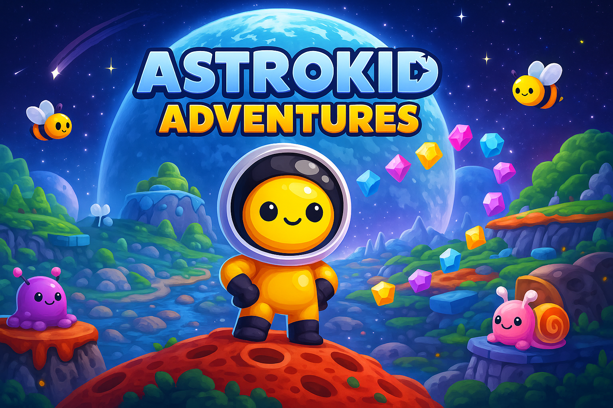

# Astrokid Adventure  



---

## Table des matières

- [À propos du projet](#à-propos-du-projet)
- [Démo en ligne](#démo-en-ligne)
- [Gameplay](#gameplay)
- [Stack technique](#stack-technique)
- [Qualité & tooling](#qualité--tooling)
- [Installation & développement](#installation--développement)
- [Structure du projet](#structure-du-projet)
- [Direction artistique](#direction-artistique)
- [Comment contribuer](#comment-contribuer)
- [Roadmap (MVP → V2)](#roadmap-mvp--v2)
- [Auteur](#auteur)
- [Licence](#licence)

---

## À propos du projet

**Astrokid Adventure** est un platformer 2D mignon et accessible, inspiré du style Kenney.  
C’est un MVP qui vise à :

- pratiquer **Phaser 3** (architecture, collisions, animations, IA simple…)
- démontrer mes compétences **techniques & artistiques**
- nourrir mon **portfolio**
- me préparer à obtenir une **alternance en développement full-stack**

Le jeu est entièrement jouable dans un navigateur moderne, sans installation.

---

## Démo en ligne
***https://astrokid-adventure.vercel.app***

---

## Gameplay

- Déplacements : marcher, courir, sauter, s’accroupir  
- Interactions : ramasser & lancer des briques  
- Ennemis : blobs, mouches, abeilles, vers  
- Items : pièces, étoiles, drapeaux de fin de niveau  
- Collisions avancées : plateformes, écrasement, dégâts, invincibilité  
- HUD dynamique : vies, score, étoiles  
- Level design réalisé avec **Tiled**

---

## Stack technique

**Core**

- **Phaser 3.55.2**
- **TypeScript** (strict)
- **Vite** (dev server + build)
- **ES Modules**

## Qualité & tooling**

- **Biome** (lint + format)
- **ESLint** (complément)
- Préparation future : **Husky** + **GitHub Actions**

---

## Installation & développement

Cloner le repo :

```bash
git clone https://github.com/<votre-utilisateur>/astrokid-adventure.git
cd astrokid-adventure
npm install
npm run dev
```

Puis ouvrir le jeu dans un navigateur moderne à l’adresse indiquée par Vite
(par défaut : http://localhost:5173).

## Structure du projet
```
src/
├── scenes/
├── entities/
│   ├── enemies/
│   ├── player/
│   └── items/
├── ui/
├── world/
└── utils/
assets/
├── enemies/
├── items/
├── maps/
├── player/
├── sounds/
├── tiles/
└── ui/
```

## Direction artistique
Style
Pixel art mignon & accessible (référence : Kenney)

Sprites isolés (pas de sprite sheets)

Grille orthogonale, 64×64 px

Couleurs douces & lisibles

**Palette officielle**
Nom	Hex
amethyst	#441151
bubblegum	#f45b69
ice	#add7f6
ink	#162028
smart	#446daa
white	#ffffff

## Comment contribuer
Voir le fichier dédié : CONTRIBUTING.md

Il décrit :

- le workflow Git basé sur la branche dev

- les conventions de commits (conventional commits)

- les guidelines dev : TypeScript strict, classes, pas de any

- les guidelines artistiques : sprites 64×64, PNG, palette, structure des dossiers

- les règles des PR : lint Biome obligatoire avant merge

---
## Roadmap (MVP → V2)
**MVP (en cours)**
- Mouvement du joueur
- Saut / duck
- Ennemis avec IA simple
- Sprites 64×64
- Items (étoiles, gemmes, briques)
- HUD + systèmes (score, vies)
- Page de victoire
- Optimisation collisions & IA

**V2 (post-MVP)**
- Système de particules
- Tests automatisés
- Support manette (Gamepad API)
- SFX dynamiques (occlusion, pitch…)
- Nouveaux niveaux + biomes
- Nouveaux ennemis avec patterns variés
- Animations complexes (chargement, transitions de scènes)
- Export Mobile
  --
## Auteur<br>
Crée par Michaël, Développeur front & game hobbyist <br>
À la recherche d’une alternance dans le développement web.<br>
Portfolio : https://www.michaelgirardet.dev/<br>
	---
## Licence
Projet open-source — licence MIT
